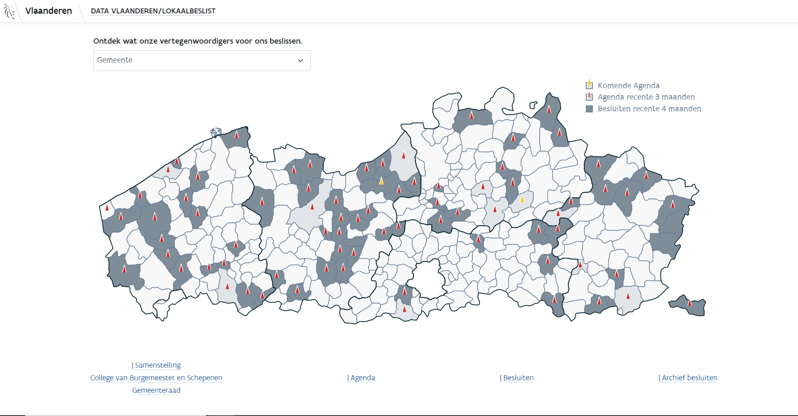
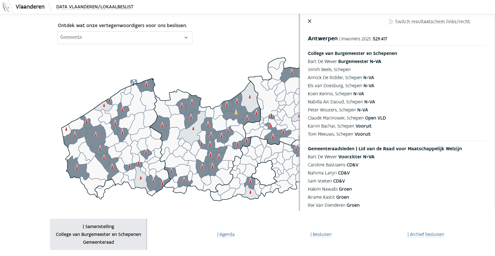
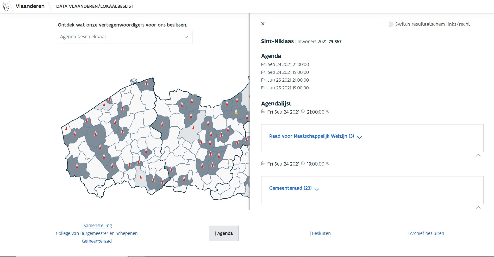

# Inform decision
This project is produced for Agentschap Binnenland Bestuur. Produced by Ember js and get the data with Sparql.
 
This project is produced to support the data from Open data semantic web technology to  informs the decision from boards of municipalities in the Vlaanderen region to show to the public.
 
* You could use a searching bar or click on the map to choose the municipalities that you would like to discovery.
* For clicking on the map, you could switch the result bar from right to left.
* A bit of a gimmick. The result from the searching bar always stays on the right hand side. If you click on the map first then choose another municipality by using a searching bar. then switch bar from right to left. It could be possible to compare 2 municipalities at the same time.
 
Try online version https://applepanithi.com/lokaalbesluit/
 
 

# Mobile friendly

